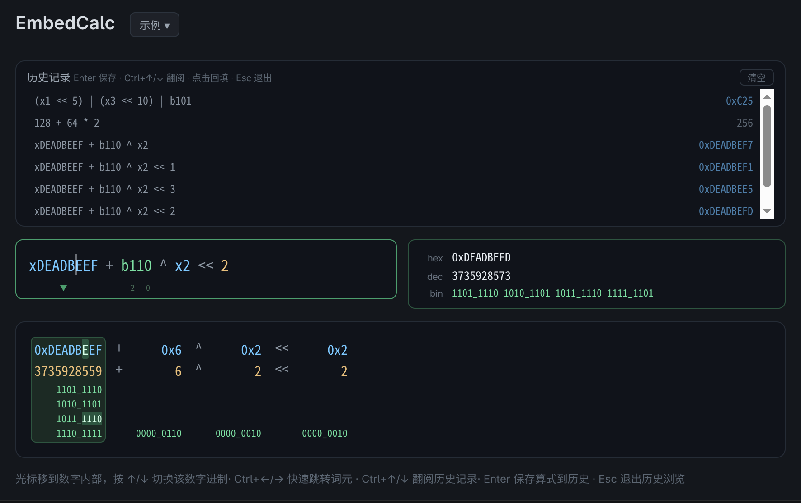

# EmbedCalc — 嵌入式混合进制计算器

**[English](README_EN.md)** | 简体中文

为嵌入式开发者设计的混合进制计算器：同一算式中自由混用十六进制、十进制和二进制数，
以 C 语言风格语法进行位运算求值。

## 使用说明

**输入算式，直接计算。** 十六进制加 `x`/`0x` 前缀，二进制加 `b`/`0b` 前缀，十进制直接写，
支持 C 语言运算符 `+ - * / %` `& | ^ ~` `<< >>` `()`：

```
xDEADBEEF + b110 ^ x2 << 2
```



- **多进制并显**：结果同时显示 hex / dec / bin 三种进制
- **逐数字进制切换**：光标移入数字，按 **↑/↓** 在 hex↔dec↔bin 间切换
- **位号标注**：二进制数字下方自动标注每 8 位分组的位号（LSB = 0）
- **词元高亮**：**Ctrl+←/→** 跳转词元并短暂闪烁，联动下方视图的 nibble 高亮
- **历史记录**：**Enter** 保存算式，**Ctrl+↑/↓** 浏览历史（当前算式自动缓存到末行），**Esc** 退出
- **BigInt 全精度**：64 位及以上整数无精度丢失，纯数学求值无位宽截断

### 注意事项

- 计算结果无位宽截断，是精确的数学值（不限 32/64 位）
- 二进制数字可以用 `_` 分隔方便阅读：`b1010_0011_1111`
- 空格分隔的相邻二进制数会自动拼接：`b110 b11` 等于 `b11011`
- 历史记录保存在本地，最多 50 条

---

## 安装

从 [Release 页面](https://github.com/spp901780/embedCalc/releases) 下载对应平台的安装包：

| 平台 | 格式 |
|------|------|
| Linux (x64 / ARM) | `.deb`、`.rpm` |
| macOS (Apple Silicon / Intel) | `.dmg` |
| Windows (x64) | `.msi`、`.exe` |

---

## 技术栈

| 层   | 技术                                  |
| ---- | ------------------------------------- |
| 前端 | Svelte 5（runes）、TypeScript、Vite 6 |
| 桌面 | Tauri v2（Rust + WebView）            |
| 构建 | pnpm、SvelteKit adapter-static        |

## 项目结构

```
├── src/                      # Svelte 前端
│   ├── app.html              # HTML 入口
│   ├── lib/calc.ts           # 核心引擎：词法分析、Pratt 解析器、进制转换、布局构建
│   └── routes/
│       ├── +layout.ts        # SvelteKit 静态 adapter 配置
│       └── +page.svelte      # 主页面：自绘输入框、历史记录、多进制视图、键盘交互
├── src-tauri/                # Tauri 桌面端
│   ├── Cargo.toml            # Rust 依赖
│   ├── tauri.conf.json       # 窗口配置、版本号、打包目标（deb / rpm）
│   ├── capabilities/         # Tauri v2 权限声明
│   ├── icons/                # 应用图标（多平台）
│   └── src/
│       ├── main.rs           # Tauri 入口
│       └── lib.rs            # Tauri 插件注册
├── static/                   # 静态资源（favicon 等）
├── image/                    # 图片资源（README 截图、应用图标源文件）
├── .github/workflows/        # CI/CD（release.yml 发布流水线）
└── .vscode/                  # VS Code 工作区配置
```

## 快速开始

```bash
# 前置条件：pnpm、Rust toolchain、Tauri CLI
pnpm install

# Web 开发模式（http://localhost:1420）
pnpm dev

# 类型检查
pnpm check

# 构建 Tauri 桌面应用（deb / rpm）
pnpm tauri build

# 开发模式启动 Tauri 桌面窗口
pnpm tauri dev
```

## License

MIT
