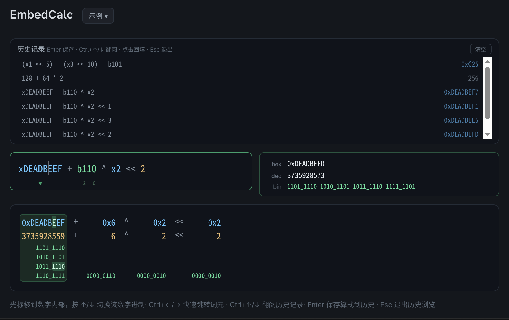

# EmbedCalc — Embedded Mixed-Radix Calculator

**[简体中文](README.md)** | English

A mixed-radix calculator designed for embedded developers: freely mix hexadecimal, decimal, and binary numbers
in the same expression, with C-style syntax for bitwise operations.

## Usage

**Type an expression, get the result instantly.** Hexadecimal uses the `x`/`0x` prefix, binary uses `b`/`0b`,
decimal is written directly. Supports C-style operators `+ - * / %` `& | ^ ~` `<< >>` `()`:

```
xDEADBEEF + b110 ^ x2 << 2
```



- **Multi-radix display**: Results shown simultaneously in hex / dec / bin
- **Per-number radix switching**: Move cursor into a number, press **↑/↓** to switch between hex↔dec↔bin
- **Radix previews**: While the editor is focused and the cursor is inside a number, faint previews above/below show the available ↑/↓ conversions. Previews are centered on the number and normally bounded by its width, with a two-character minimum for one-digit numbers. Ellipses are used only when at least three characters fit.
- **Bit editing**: Click a binary bit in number inspection, or focus it and press Enter/Space, to toggle and recalculate immediately. The original radix is retained; character literals become decimal numbers. Padded leading bits are editable. Invalid/incomplete expressions disable editing; toggles do not automatically save history.
- **Bit position annotations**: Binary numbers automatically show bit positions for each 8-bit group (LSB = 0)
- **Token highlighting**: **Ctrl+←/→** jumps between tokens with a brief flash; linked nibble highlighting in the view below
- **History**: **Enter** saves complete valid expressions; **Ctrl+↑/↓** browses history (current expression cached as a draft), **Esc** restores the draft. Clearing history requires confirmation; legacy entries remain compatible.
- **Native editing**: textarea-backed input supports composition, native selection, clipboard operations and ordinary-edit undo/redo. Incomplete expressions are labeled as previews and cannot be saved; retained error-state results are explicitly marked as the last valid value.
- **Dark workbench**: collapsible history above the compact editor/results, followed by number inspection. Empty input shows an expression hint. Narrow windows stack vertically. Base conversion has clickable controls; copy buttons are always visible and report success or failure.
- **BigInt full precision**: No precision loss for 64-bit and larger integers, pure mathematical evaluation without bit-width truncation

### Notes

- Results are exact mathematical values with no bit-width truncation (not limited to 32/64 bits)
- Binary numbers can use `_` separator for readability: `b1010_0011_1111`
- Adjacent binary numbers separated by spaces are automatically concatenated: `b110 b11` equals `b11011`
- History is saved locally, up to 50 entries

---

## Installation

Download the installer for your platform from the [Releases page](https://github.com/spp901780/embedCalc/releases):

| Platform | Format |
|----------|--------|
| Linux (x64 / ARM) | `.deb`, `.rpm` |
| macOS (Apple Silicon / Intel) | `.dmg` |
| Windows (x64) | `.msi`, `.exe` |

---

## Tech Stack

| Layer   | Technology                              |
| ------- | --------------------------------------- |
| Frontend | Svelte 5 (runes), TypeScript, Vite 6   |
| Desktop | Tauri v2 (Rust + WebView)               |
| Build   | pnpm, SvelteKit adapter-static          |

## Project Structure

```
├── src/                      # Svelte frontend
│   ├── app.html              # HTML entry
│   ├── lib/calc.ts           # Core engine: tokenizer, Pratt parser, radix conversion, layout builder
│   └── routes/
│       ├── +layout.ts        # SvelteKit static adapter config
│       └── +page.svelte      # Main page: custom input, history, multi-radix view, keyboard interactions
├── src-tauri/                # Tauri desktop
│   ├── Cargo.toml            # Rust dependencies
│   ├── tauri.conf.json       # Window config, version, build targets (deb / rpm)
│   ├── capabilities/         # Tauri v2 permission declarations
│   ├── icons/                # Application icons (multi-platform)
│   └── src/
│       ├── main.rs           # Tauri entry point
│       └── lib.rs            # Tauri plugin registration
├── static/                   # Static assets (favicon, etc.)
├── image/                    # Image assets (README screenshots, app icon source)
├── .github/workflows/        # CI/CD (release.yml pipeline)
└── .vscode/                  # VS Code workspace config
```

## Getting Started

```bash
# Prerequisites: pnpm, Rust toolchain, Tauri CLI
pnpm install

# Web development mode (http://localhost:1420)
pnpm dev

# Type checking
pnpm check

# Build Tauri desktop app (deb / rpm)
pnpm tauri build

# Run Tauri desktop window in development mode
pnpm tauri dev
```

## License

MIT
